# PhilTreeCrawler Implementation Plan

## Current State

The project has a complete folder structure with placeholder files, all dependencies installed, database schema ready ([supabase/schema.sql](supabase/schema.sql)), and the Supabase browser client implemented. The task is to implement all functionality defined in TECH_SPEC.md.

---

## Parallelized Implementation Strategy

The plan is structured into **two parallel tracks** that can be built simultaneously, followed by sequential phases for features with hard dependencies.

```mermaid
flowchart LR
    subgraph trackA [Track A - Foundation Services]
        direction TB
        types[Types]
        supabase[Supabase Queries]
        gemini[Gemini Service]
        openai[OpenAI Embeddings]
        youtube[YouTube API]
        exa[Exa API]
        store[Session Store]
    end

    subgraph trackB [Track B - Auth and Layout]
        direction TB
        authAPI[Auth API Routes]
        authComp[Auth Components]
        authPages[Auth Pages]
        layoutComp[Layout Components]
    end

    trackA --> onboarding
    trackB --> onboarding

    subgraph onboarding [Phase 2 - Onboarding]
        onboardData[Static Data]
        onboardAPI[API Routes]
        onboardUI[Components and Pages]
    end

    onboarding --> exploration

    subgraph exploration [Phase 3 - Core Exploration]
        conceptAPI[Concept APIs]
        exploreUI[Explore UI]
    end

    exploration --> advanced

    subgraph advanced [Phase 4 - Advanced Features]
        deeper[Go Deeper]
        graphView[Graph View]
    end

    advanced --> polish[Phase 5 - Polish]
```



**Why this works:**

- Track B (Auth + Layout) only depends on the existing Supabase browser client
- Auth uses Supabase Auth directly, not our custom DB queries
- Layout components have no service dependencies
- All Track A services are independent of each other

---

## Track A: Foundation Services (All Parallel)

These can all be built simultaneously as they have no inter-dependencies.

### A.1 TypeScript Types ([src/types/index.ts](src/types/index.ts))

Define all shared types:

- Database entities: `Concept`, `Edge`, `UserProfile`, `TextFamiliarity`, `CategoryFamiliarity`
- API request/response types for each endpoint
- Component props interfaces
- Session state types (`SessionState`, `DeeperCache`)
- External API response types (`Video`, `Book`)
- Graph data types (`GraphNode`, `GraphEdge`)

### A.2 Supabase Database Queries ([src/lib/supabase/index.ts](src/lib/supabase/index.ts))

Complete [src/lib/supabase/server.ts](src/lib/supabase/server.ts) for server-side client, then implement:

- `getConceptById`, `getConceptBySlug`
- `getEdgesFromConcept`
- `findNearestConcepts` (vector similarity search using pgvector)
- `createConcept`, `createEdge`
- `incrementBranchStat`, `getBranchStats`
- `checkRateLimit`, `logGeneration`
- `incrementNodesExplored`
- User familiarity CRUD functions

### A.3 Gemini Flash Service ([src/lib/gemini/index.ts](src/lib/gemini/index.ts))

```typescript
generateLesson(conceptName: string): Promise<{ description: string; recommendedReading: string[] }>
generateBranches(concept: Concept): Promise<Branch[]>
generateSocraticQuestion(concept: Concept, history?: Message[]): Promise<string>
generateSocraticResponse(concept: Concept, history: Message[], answer: string): Promise<{ response: string; nextQuestion?: string }>
generateExpandedDescription(concept: Concept): Promise<string>
generateQuizQuestion(category: string, subtopic: string, priorAnswers?: Answer[]): Promise<Question>
evaluateQuizResult(answers: Answer[]): QuizEvaluationGeneration  // Algorithmic, not LLM-based
```

### A.4 OpenAI Embeddings ([src/lib/openai/index.ts](src/lib/openai/index.ts))

```typescript
generateEmbedding(text: string): Promise<number[]>  // 1536-dim vector
```

### A.5 YouTube Data API ([src/lib/youtube/index.ts](src/lib/youtube/index.ts))

```typescript
searchVideos(query: string): Promise<Video[]>
```

### A.6 Exa.ai ([src/lib/exa/index.ts](src/lib/exa/index.ts))

```typescript
searchBooks(query: string): Promise<Book[]>
```

### A.7 Session State Store ([src/store/index.ts](src/store/index.ts))

Implement client-side state using Zustand:

- `path: string[]` - exploration stack
- `deeperCache: Record<string, DeeperContent>` - ephemeral Go Deeper content
- `visitedNodes: Set<string>` - for graph view
- `graphNodes`, `graphEdges` - graph visualization data

---

## Track B: Auth and Layout (Parallel with Track A)

These can be built alongside Track A since they only depend on the existing Supabase browser client.

### B.1 Auth API Routes

**[src/app/api/auth/signup/route.ts](src/app/api/auth/signup/route.ts)**:

- POST handler using Supabase Auth `signUp()`

**[src/app/api/auth/login/route.ts](src/app/api/auth/login/route.ts)**:

- POST handler using `signInWithPassword()`

**[src/app/api/auth/logout/route.ts](src/app/api/auth/logout/route.ts)**:

- POST handler using `signOut()`

**[src/app/api/auth/me/route.ts](src/app/api/auth/me/route.ts)**:

- GET handler returning current user + profile

### B.2 Auth Components ([src/components/auth/](src/components/auth/))

- `LoginForm` - email/password with validation, error display
- `SignupForm` - registration with password confirmation
- `AuthGuard` - wrapper component that redirects unauthenticated users

### B.3 Auth Hook ([src/hooks/index.ts](src/hooks/index.ts))

```typescript
useAuth(): { user, profile, login, logout, signup, loading }
```

### B.4 Auth Pages

- `src/app/(auth)/login/page.tsx`
- `src/app/(auth)/signup/page.tsx`
- Update `src/app/page.tsx` as landing page with CTAs

### B.5 Layout Components ([src/components/layout/](src/components/layout/))

- `AppShell` - main layout with NavBar and content area
- `NavBar` - logo, user menu, graph link (if unlocked)
- `BackButton` - navigate to previous concept in path
- `PathBreadcrumbs` - show current exploration path

Update `src/app/(main)/layout.tsx` to wrap with AppShell and AuthGuard.

---

## Phase 2: Onboarding Flow (After Tracks A+B)

Requires: Gemini service (for quiz), Supabase queries (for saving familiarity), Auth (for user context).

### 2.1 Static Data

Create `src/lib/onboarding/data.ts`:

- Canonical philosophical texts list (~20-30 texts)
- Category structure with subtopics:
  - Ethics: Virtue Ethics, Deontology, Consequentialism, Meta-Ethics, Applied Ethics
  - Metaphysics: Ontology, Free Will, Mind-Body Problem, Time, Causation
  - Epistemology: Rationalism, Empiricism, Skepticism, Justified Belief
  - etc.

### 2.2 API Routes

**[src/app/api/onboarding/texts/route.ts](src/app/api/onboarding/texts/route.ts)**:

- GET - return canonical texts list

**[src/app/api/onboarding/categories/route.ts](src/app/api/onboarding/categories/route.ts)**:

- GET - return categories with subtopics

**[src/app/api/onboarding/familiarity/route.ts](src/app/api/onboarding/familiarity/route.ts)**:

- POST - save user's familiarity data to DB

**[src/app/api/onboarding/quiz/route.ts](src/app/api/onboarding/quiz/route.ts)**:

- POST - generate quiz questions via Gemini, return result when complete

**[src/app/api/onboarding/recommendations/route.ts](src/app/api/onboarding/recommendations/route.ts)**:

- GET - query user familiarity, recommend starting concepts

### 2.3 Onboarding Components ([src/components/onboarding/](src/components/onboarding/))

- `TextFamiliarityList` - scrollable list with read/not-read toggles
- `CategoryAccordion` - expandable categories with subtopic rows
- `FamiliarityRating` - Beginner/Intermediate/Advanced/Help Me Decide buttons
- `QuizQuestion` - single question card with options
- `OnboardingProgress` - step indicator (Step 1/3, Step 2/3, etc.)

### 2.4 Onboarding Pages

- `src/app/(main)/onboarding/page.tsx` - multi-step wizard
- `src/app/(main)/onboarding/quiz/page.tsx` - quiz flow
- `src/app/(main)/start/page.tsx` - choose starting point

---

## Phase 3: Core Exploration

Requires: All services from Track A, Auth from Track B.

### 3.1 Concept API Routes

**[src/app/api/concepts/[slug]/route.ts](src/app/api/concepts/[slug]/route.ts)**:

- GET - fetch concept by slug with edges

**[src/app/api/concepts/search/route.ts](src/app/api/concepts/search/route.ts)**:

- GET - text search on concept names

**[src/app/api/concepts/nearest/route.ts](src/app/api/concepts/nearest/route.ts)**:

- POST - vector similarity search for 3 nearest neighbors

**[src/app/api/concepts/generate/route.ts](src/app/api/concepts/generate/route.ts)**:

- POST - generate new concept via Gemini + embedding
- Check rate limit, log generation

**[src/app/api/concepts/[id]/branches/route.ts](src/app/api/concepts/[id]/branches/route.ts)**:

- GET - fetch existing branches

**[src/app/api/concepts/[id]/branches/generate/route.ts](src/app/api/concepts/[id]/branches/generate/route.ts)**:

- POST - generate 4 new branches via Gemini
- Create edges in DB

**[src/app/api/concepts/[id]/choose/route.ts](src/app/api/concepts/[id]/choose/route.ts)**:

- POST - record branch choice for analytics

### 3.2 User API Routes

**[src/app/api/user/profile/route.ts](src/app/api/user/profile/route.ts)**:

- GET - return user profile

**[src/app/api/user/explore/route.ts](src/app/api/user/explore/route.ts)**:

- POST - increment nodes explored, check graph unlock

**[src/app/api/user/rate-limit/route.ts](src/app/api/user/rate-limit/route.ts)**:

- GET - check generation allowance

### 3.3 Explore Components ([src/components/explore/](src/components/explore/))

- `LessonCard` - description + recommended reading list
- `ActionButtons` - "Go Deeper" and "Explore New Branch" buttons
- `BranchOptions` - shows nearest neighbors + "Generate New" option
- `NewBranchOptions` - displays 4 generated branches
- `BranchCard` - single branch with type badge (constructive/critique/author/wildcard)
- `GeneratingOverlay` - loading state with countdown timer
- `RateLimitWarning` - display when limit exceeded

### 3.4 Explore Hooks

```typescript
useConcept(slug): { concept, edges, loading, error }
useNearestConcepts(conceptId): { concepts, loading, fetch }
useGenerateConcept(): { generate, loading, concept }
useGenerateBranches(conceptId): { generate, loading, branches }
useRateLimit(): { allowed, remaining, resetAt, check }
useExplorationPath(): { path, push, pop, current }
```

### 3.5 Explore Page

`src/app/(main)/explore/[slug]/page.tsx`:

- Fetch concept data
- Display LessonCard
- Handle branching flow (nearest neighbors -> generate new)
- Track exploration path
- Increment nodes explored on visit

---

## Phase 4: Advanced Features (Go Deeper + Graph)

These can be built in parallel after Phase 3.

### 4.1 Go Deeper API Routes

**[src/app/api/deeper/socratic/route.ts](src/app/api/deeper/socratic/route.ts)**:

- POST - start Socratic dialogue, generate initial question

**[src/app/api/deeper/socratic/respond/route.ts](src/app/api/deeper/socratic/respond/route.ts)**:

- POST - handle user response, generate follow-up

**[src/app/api/deeper/expand/route.ts](src/app/api/deeper/expand/route.ts)**:

- POST - generate expanded description

**[src/app/api/deeper/videos/route.ts](src/app/api/deeper/videos/route.ts)**:

- POST - search YouTube via API

**[src/app/api/deeper/books/route.ts](src/app/api/deeper/books/route.ts)**:

- POST - search books via Exa.ai

### 4.2 Go Deeper Components ([src/components/deeper/](src/components/deeper/))

- `DeeperMenu` - 4 option cards (Socratic, Videos, Expand, Books)
- `SocraticDialogue` - chat interface with message history
- `SocraticMessage` - individual message bubble
- `ExpandedDescription` - extended lesson content
- `VideoResults` - grid of video cards
- `VideoCard` - thumbnail, title, channel, link
- `BookResults` - list of book cards
- `BookCard` - cover, title, author, purchase link

### 4.3 Go Deeper Hooks

```typescript
useSocraticDialogue(conceptId): { history, startDialogue, respond, loading }
useDeeper(conceptId): { expand, findVideos, findBooks, cache }
useSessionCache(): { get, set, clear }
```

### 4.4 Go Deeper Page

`src/app/(main)/explore/[slug]/deeper/page.tsx`:

- Display DeeperMenu
- Render selected option (Socratic, Videos, etc.)
- Cache results in session store

### 4.5 Graph Components ([src/components/graph/](src/components/graph/))

- `GraphCanvas` - Cytoscape.js container with layout configuration
- `GraphNode` - custom node styling (visited nodes)
- `NodeTooltip` - hover info with concept name
- `GraphControls` - zoom, pan, reset buttons
- `GraphLockOverlay` - "Explore N more nodes to unlock" message

### 4.6 Graph Hooks

```typescript
useGraphData(): { nodes, edges, addNode, addEdge }
```

Build graph data from visited nodes and their edges.

### 4.7 Graph Page

`src/app/(main)/graph/page.tsx`:

- Check if graph unlocked (10+ nodes explored)
- Render GraphCanvas with user's explored concepts
- Click node to navigate to `/explore/[slug]`
- Actions: Go Deeper, Explore New Branch from any node

---

## Phase 5: Polish

### 5.1 Error Handling

Create error components:

- `src/app/not-found.tsx` - 404 page with search
- `src/app/error.tsx` - generic error boundary
- Toast notifications for API errors

### 5.2 Analytics Display (Nice-to-Have)

Add `BranchStats` component to show "64% of users chose..." on branch options.

### 5.3 Testing

- Verify all service functions work with real API keys
- Test auth flow end-to-end
- Complete onboarding manually
- Create a seed concept, test exploration and generation
- Test all Go Deeper features
- Explore 10+ nodes, verify graph unlocks

---

## Environment Variables

Ensure `.env.local` contains:

```
NEXT_PUBLIC_SUPABASE_URL=...
NEXT_PUBLIC_SUPABASE_ANON_KEY=...
SUPABASE_SERVICE_ROLE_KEY=...
GEMINI_API_KEY=...
OPENAI_API_KEY=...
YOUTUBE_API_KEY=...
EXA_API_KEY=...
```
